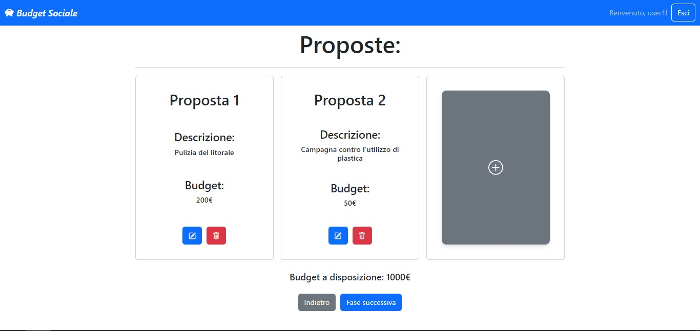
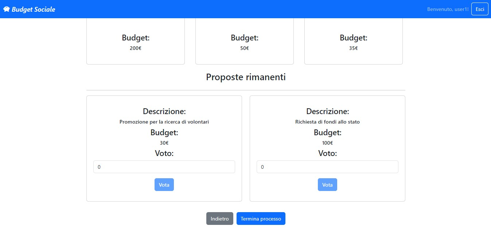

# Exam #2: "Budget Sociale"
## Student: s315067 MESSINEO NUNZIO 

Istruzioni per l'uso:
``` sh
git clone ...yourCloneURL... # https://github.com/Nunziojh/BudgetSociale.git
cd ...yourProjectDir...
git pull origin main  # just in case the default branch is not main 
(cd server ; npm install; nodemon index.mjs)
(cd client ; npm install; npm run dev)
```

## React Client Application Routes

- Route `/associazioni`: home page con le informazioni base dell'associazione
- Route `/associazioni/associazione`: route dedicata alle varie fasi della gestione del budget sociale dell'associazione
- Route `/login`: route dedicata per effettuare il login

## API Server

  ### API per la connessione al database e per la gestione delle sessioni

- POST `/api/sessions`
  - Questa route permette di autenticare un utente.
  - request
    - parametri: nessuno
    - body: json {credentials} con all'interno username e password dell'utente da autenticare
  - response 
    - body: json {user} dati dell'utente autenticato
  - error: error info
- GET `/api/sessions/current`
  - Questa route controlla se l'utente è connesso o meno.
  - request
    - parametri: nessuno
    - body: nessuno
  - response
    - body: json {user} dati dell'utente autenticato
  - error: status 401, Not authenticated
- DELETE `/api/session/current` 
  - Questa route permette di disconnettere l'utente.
  - request
    - parameters: nessuno
    - body: nessuno
  - response 
    - body: nessuno

### API per la gestione dell'associazione

#### Home Page
- GET `/api/associations` 
  - Questa route ritorna la lista della associazioni ( una in questo caso )
  - request
    - parameters: nessuno
    - body: nessuno
  - response
    - body: array di associazioni

#### Fase 0

- PATCH `/api/associations/association/set-budget`
  - Questa route e' usata dalll'admin per settare il budget
  - request 
    - parameters: nessuno
    - body: budget, credentials:'include'
  - response
    - body: 'Budget updated at ${budget}'
  - error:
    - campo mancante
    - budget non valido
    - fase non valida
- PATCH `/api/associations/association/budget`
  - Questa route e' usata per passare dalla fase 0 alla fase 1
  - request:
    - parameters: nessuno
    - body: credentials:'include'
  - response:
    - body: 'Phase has been update to 1'
  - error:
    - fase non valida

#### Fase 1

- GET `/api/associations/association/proposals`
  - Questa route e' utilizzata per ottenere tutte le proposte dell'utente loggato
  - request:
    - parameters: nessuno
    - body: credentials:'include'
  - response:
    - body: array di proposte
  - error:
    - fase non valida

- POST `/api/associations/association/proposals`
  - Questa route e' usata per effettuare una proposta da parte di un utente loggato
  - request:
    - parameters: nessuno
    - body: budget, descrizione
  - response:
    - body: {PID,budget,description}
  - error:
    - fase non valida
    - argomenti mancanti o vuoti

- PATCH `/api/associations/association/proposals`
  - Questa route e' usata per modificare una proposta esistente da parte dell'utente che l'ha create
  - request:
    - parameters: nessuno
    - body: {PID, budget, description}
  - response:
    - body: {PID, budget, description}
  - error:
    - fase non valida
    - mancanza di parametri

- DELETE `/api/associations/association/proposals`
  - Questa route e' usata per cancellare una proposta da parte dell'utente che l'ha creata
  - request:
    - parameters: nessuno
    - body: PID, credentials:'include'
  - response:
    - body: 'Proposal ${PID} has been deleted successfully'
  - error: 
    - fase non valida
    - parametri mancanti

- PATCH `/api/associations/association/proposals/upgrade`
  - Questa route e' usate per passare dalla fase 1 alla fase 2
  - request:
    - parameters: nessuno
    - body: credentials:'include'
  - response:
    - body: 'Phase upgraded successfully'
  - error:
    - fase non valida
    - nessuna proposta presentata

#### Fase 2

- GET `/api/associations/association/votes`
  - Questa route e' usata per ottenere tutte le proposte fatte dagli utenti (da parte di un utente loggato)
  - request:
    - parameters: nessuno
    - body: credentials:'include'
  - response:
    - body: array di proposte
  - error:
    - fase non valida

- GET `/api/associations/association/votes/get-votes`
  - Questa route e' usata per ottenere tutti i voti effettuati dall'utente loggato
  - request:
    - parameters: nessuno
    - body: credentials:'include'
  - response:
    - body: array di voti
  - error:
    - fase non valida

- POST `/api/associations/association/votes`
  - Questa route e' usata per la creazione di un voto da parte di un utente loggato
  - request: 
    - parameters: nessuno
    - body: PID, valutazione, credenziali
  - response:
    - body: 'The vote has been created successfully for the proposal ${PID}'
  - error:
    - fase non valida
    - valutazione non valida
    - parametri mancanti
    - proposta non esistente
    - votazione gia' esistente

- DELETE `/api/associations/association/votes`
  - Questa route e' utilizzata per cancellare uno specifico voto da parte dell'utente che l'ha creato
  - request:
    - parameters: nessuno
    - body: PID, credentials
  - response:
    - body: 'Vote has been deleted successfully'
  - error:
    - fase non valida
    - parametri mancanti
    - nessuna valutazione da cancellare per questo PID

- PATCH `/api/associations/association/votes`
  - Questa route e' utilizzata per passare dalla fase 2 alla 3
  - request:
    - parameters: nessuno
    - body: credentials
  - response:
    - body: 'Phase upgraded successfully'
  - error:
    - fase non valida

#### Fase 3

- GET `/api/associations/association/results`
  - Questa route e' utilizzata per ottenere (e calcolare) i risultati della classifica finale delle proposte
  - request:
    - parameters: nessuno
    - body: nessuno
  - response:
    - body: array di proposte con somma totale dei voti ricevuti
  - error:
    - fase non valida

- DELETE `/api/associations/association/results`
  - Questa route e' utilizzata per effettuare il reset della processo di scelta delle proposte da parte dell'admin
  - request:
    - parameters: nessuno
    - body: credenziali
  - response:
    - body: 'Phase reset successfully'
  - error:
    - fase non valida

## Database Tables

- Table `Users` (
	"id"	INTEGER NOT NULL UNIQUE,
	"email"	TEXT NOT NULL UNIQUE,
	"name"	TEXT NOT NULL,
	"hash"	TEXT NOT NULL,
	"salt"	TEXT NOT NULL,
  "role" TEXT NOT NULL,
	PRIMARY KEY("id" AUTOINCREMENT)
);

- Table `Associations` (
	"Name"	TEXT NOT NULL,
	"Budget"	INTEGER NOT NULL,
	"Phase"	INTEGER NOT NULL,
	"Admin"	INTEGER NOT NULL,
	"URI"	TEXT,
	"Description" TEXT
);

  Non ho aggiunto un identificativo per le associazioni in quanto per questo caso semplificato con una sola associazione non e' necessario. L'admin all'interno della tabella risulta una ridondanza se ho un'unico admin per tutta la web app.

- Table `Proposals` (
	"PID"	INTEGER NOT NULL UNIQUE,
	"Description"	TEXT NOT NULL,
	"Budget"	INTEGER NOT NULL,
	"UserID"	INTEGER NOT NULL,
  "IsTaken" INTEGER,
	PRIMARY KEY("PID" AUTOINCREMENT)
);

- Table `Votes` (
	"VID"	INTEGER NOT NULL UNIQUE,
	"PID"	INTEGER NOT NULL UNIQUE,
	"Value"	INTEGER NOT NULL,
	"UserID"	INTEGER NOT NULL,
	PRIMARY KEY("VID" AUTOINCREMENT)
);

## Main React Components

- `App` (in `App.jsx`): componente per la gestione delle route con all'interno anche la useEffect usata per il controllo della sessione, ottenere le info sull'associazione, gestire messaggi di errore e performare il loading durante le richieste al db.
- `LoginForm` (in `Auth.jsx`): componente per il frontend della fase di login con la gestione dei form per l'inserimento dei dati.
- `FasiLayout` (in `MainLayout.jsx`): componente che ha la funzione di controller per la visualizzazione delle schermate in base alla fase attuale.
- `BudgetLayout` (in `BudgetLayout.jsx`): frontend della fase 0, garantisce all'admin di settare il budget e a tutti gli altri fa visualizzare un messaggio.
- `ProposalsLayout` (in `ProposalsLayout.jsx`): frontend della fase 1 per la gestione della creazione, modifica e cancellazione delle proposte. All'interno ha una useEffect principale che va a riottenere il vettore delle proposte ad ogni modifica che avviene all'interno del componente. L'altra useEffect setta il flag modified a true in modo da forzare il richiamo delle informazioni all'avvio e rifarsi principalmente ad una sola useEffect. A sua volta richiama il componente ProposalForm per la gestione del form per ogni singola proposta.
- `VotesLayout` (in `VotesLayout.jsx`): frontend della fase 2 per la gestione delle votazioni. La gestione delle proposte viene effettuata tramite l'utilizzo di tre State riguardanti rispettivamente: il vettore delle votazioni effettuate (preferences), il vettore delle proprie proposte (myProposals) ed il vettore delle proposte rimanenti (remainingProposals). All'interno di questo componente vi è una useEffect principale che ad ogni cambiamento dello state modified va a riottenere tutta la lista aggiornata delle proposte e la va a salvare nello state allProposals. Al variare di quest'ultimo avviene l'esecuzione di un altra useEffect a cascata che solo una volta ottenuti i valori va a riempire i tre array sopra citati. Queste due useEffect possono anche essere unite, ma in questo modo non ottengo visibili cambianti di comportamento. Questo componente utilizza a sua volta VotesForm per avere un form di inserimento dei voti e ProposalsGrid per il raggruppanto per chunk di tre elementi all'interno della stessa riga.
- `ResultsLayout` (in `ResultsLayout.jsx`): componente per la gestione del frontend della fase 3 con la visualizzazione dei risultati. Utilizza principalmente due state riguardanti le proposte prese e non prese e vengono visualizzate in due parti separate dello schermo a tre alla volta, utilizzando il componente ResultsGrid.

## Screenshot




## Users Credentials

| User | Email | Password | Role |
|-----------|-----------|-----------|-----------|
| user1  | user1@polito.it | password1  | admin |
| user2  | user2@polito.it | password2  | member |
| user3  | user3@polito.it | password3  | member |
| user4  | user4@polito.it | password4  | member |